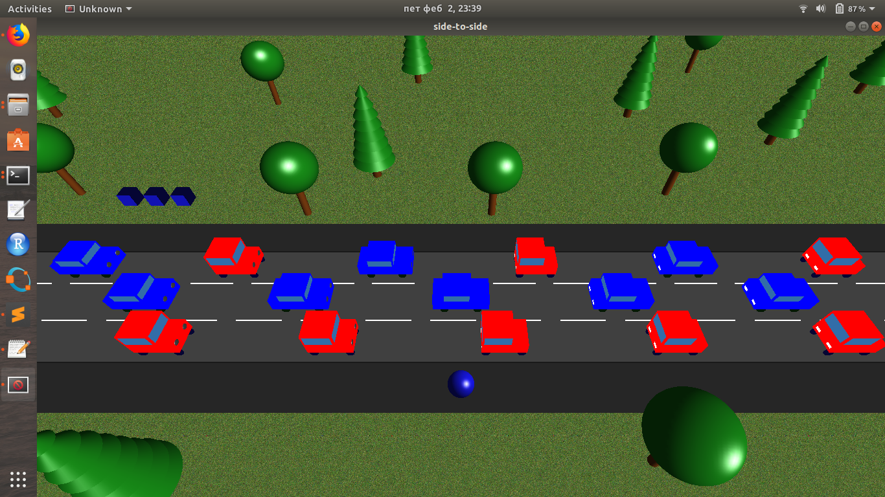

## RG110-side-to-side
Side to side

[](https://www.youtube.com/watch?v=R-7GHiPx8OI)

## :package: Instalation
Requirements: glut

1. clone this repository to your machine:
```
git clone https://github.com/MATF-RG17/RG110-side-to-side.git ~/
```
2. compile:
```
cd RG110-side-to-side
make
```
3. run:
```
./main
```


## :video_game: Controls

<table>
	<tr>
		<th colspan="2"> Global </th>
	</tr>
	<tr>
		<td>Exit</td><td>Esc</td>
	</tr>
	<tr>
		<td>Start</td><td>g</td>
	</tr>
	<tr>
		<td>Reset</td><td>r</td>
	</tr>
	<tr>
		<td>Pause</td><td>p</td>
	</tr>
	<tr>
		<th colspan="2"> Moving </th>
	</tr>
	<tr>
		<td>Left</td><td>a</td>
	</tr>
	<tr>
		<td>Right</td><td>d</td>
	</tr>
	<tr>
		<td>Forward</td><td>w</td>
	</tr>
	<tr>
		<td>Backward</td><td>s</td>
	</tr>
</table>
